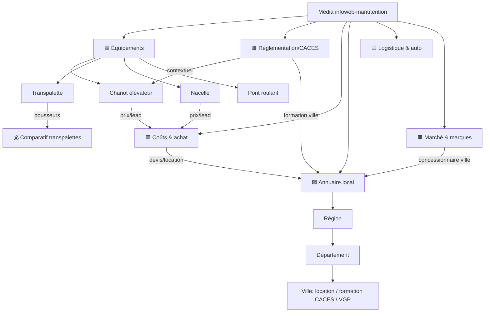

# Cocon sémantique & silos — architecture éditoriale

> Fondé sur : les 6 rubriques + 8 applications créées, la cartographie de
> mots-clés (`mots-cles-cartographie.md`), les volumes réels (`bulk-mots-cles`),
> les URLs héritées (`permaliens-a-forcer.csv`) et les concurrents (batamat,
> industrie-magazine). **Principe média** : on ne vend pas en ligne — on informe,
> on affilie le petit matériel, on génère des leads sur le gros et les services.

---

## 1. Les trois règles du cocon

1. **Un silo est étanche.** Chaque silo a UNE tête (pilier), des sous-piliers (familles), des articles de soutien. Le jus circule **à l'intérieur**.
2. **Le maillage suit une logique, pas l'exhaustivité.** Toutes les pages ne se lient PAS entre elles (détail §4). On relie ce qui est sémantiquement voisin et ce qui sert la conversion.
3. **Le business décide de la sortie.** Chaque silo pointe vers sa brique de monétisation : affiliation (petit matériel), lead/devis (gros matériel + services), autorité (aimant à liens + annonceurs).

---

## 2. Les silos

### 🟦 Silo A — Équipements de manutention & levage (le cœur, affiliation + lead)
**Pilier A** : « Le matériel de manutention et de levage » (guide chapeau).
**Sous-piliers (familles = catégories existantes)** : chariot élévateur · transpalette · gerbeur · nacelle · pont roulant · palan & treuil · diable · table élévatrice · rayonnage.

Sous chaque famille, 3 types de page :
- **Guide famille** (pilier de la famille) — informationnel, tête de sous-silo.
- **Money page** (comparatif/guide d'achat) — *uniquement pour le petit matériel affiliable* : transpalette, gerbeur, diable, palan, rayonnage, table élévatrice. → **AFF**
- **Pousseurs** (« comment choisir un X », « X manuel ou électrique », « huile transpalette », « capacité de charge ») → maillent vers la money page. → **AFF**
- Pour le **gros matériel** (chariot, nacelle, pont roulant) : pas de money page (pas d'achat en ligne) → **page prix** (Silo C) + **devis/annuaire** (Silo D). → **LEAD**

### 🟥 Silo B — Réglementation & conduite en sécurité (autorité — aimant à liens)
**Pilier B** : le **guide CACES** (déjà publié) — la référence.
**Sous-thèmes** : CACES par recommandation (R.489, R.486, R.485, R.482…) · autorisation de conduite · « est-il obligatoire d'avoir un CACES » · VGP · aptitude/suivi de santé · consignes de sécurité · responsabilité employeur.

*Confirmé par batamat* : « caces permis » 3273, « passer un caces », « carte caces », « le caces », « diplôme caces » — **demande massive**, mal servie par les e-commerce. Un média la capte avec de l'autorité vérifiée.

**Sortie business** : ce silo ne monétise pas en direct — il **alimente** : chaque article réglementaire pointe vers (a) la **famille d'engin** concernée (Silo A) et (b) l'**annuaire formation CACES {ville}** (Silo D, lead). C'est le moteur d'autorité + le pourvoyeur de leads formation.

### 🟩 Silo C — Coûts, achat, financement (lead + affiliation)
**Pilier C** : « Combien coûte / acheter ou louer du matériel de manutention ».
**Sous-thèmes** : prix par engin (chariot, nacelle, **pont roulant**, transpalette) · location vs achat · LLD / crédit-bail / financement · TCO · occasion.

*Créneau confirmé* : `pont roulant prix` (140, allintitle 0), `chariot élévateur prix` (400) — sources françaises datées quasi absentes. **Notre signature = repères de prix datés.**
**Sortie** : chaque page prix → **devis** + **annuaire location {ville}**. → LEAD (gros) / AFF (petit).

### 🟪 Silo D — Annuaire local (LE gisement lead, faible concurrence)
**Pilier D** : « Annuaire des prestataires de la manutention ».
**Hiérarchie géo étanche** : national → région → département → ville.
**Croisement** : niveau géo × **activité** (location · vente · réparation · **formation CACES** · **contrôle VGP** · concessionnaire {marque}) × **famille** (chariot · nacelle · transpalette).

*Confirmé* : `formation caces {ville}` (allintitle **0**, CPC jusqu'à 5 €/clic), `location chariot élévateur {ville}` (allintitle 0, CPC 6,70 €), cluster location batamat (nacelle/télescopique). **Volume réel + zéro concurrence + intention lead + CPC élevé.**
**Sortie** : formulaire de mise en relation (devis) sur chaque fiche → **LEAD**. C'est le module à construire (tables + gabarits + import).

### 🟨 Silo E — Logistique, entrepôt & automatisation (autorité, ouverture média)
**Pilier E** : « Intralogistique : organiser et automatiser l'entrepôt ».
**Sous-thèmes** : préparation de commandes · WMS/TMS · AGV/AMR · convoyeurs · transstockeurs · flux/allées · ergonomie/TMS. → **AUTORITÉ** (élargit le média au-delà du seul engin, attire annonceurs automatisation).

### 🟫 Silo F — Marché & marques (autorité + sponsoring)
**Pilier F** : « Le marché de la manutention : constructeurs, marques, réseaux ».
**Sous-thèmes** : classement des marques (publié) · fabricants · réseaux SAV/concessionnaires · décryptages. → **AUTORITÉ + sponsoring**. Se relie à l'annuaire (concessionnaire {marque} {région}).

---

## 3. Les hubs transversaux (ils tirent le jus, ne le diluent pas)

Certaines pages **croisent** plusieurs silos. Elles agrègent des liens sortants vers les silos, mais **les silos ne renvoient pas tous vers elles** (sinon on casse l'étanchéité).

- **Pages sectorielles** « Manutention en {secteur} » (agroalimentaire, pharma, chimie/ATEX, auto, aéro, métallurgie…) : croisent Équipement × Réglementation × Contraintes secteur. Elles lient VERS les familles d'engin + articles réglementaires pertinents. → AUTORITÉ + LEAD sectoriel.
- **Pages Énergie / BTP / Chimie-Pharma** (rubriques-domaines) : hubs de domaine qui pointent vers les articles concernés.

---

## 4. Règles de maillage interne (la logique SEO)

1. **Vertical, toujours** : article → pilier de famille → pilier de silo (et retour). C'est l'ossature.
2. **Horizontal intra-silo, limité** : une page ne lie qu'à ses **sœurs sémantiques** directes (ex. « transpalette manuel ou électrique » ↔ « comment choisir un transpalette » ↔ comparatif transpalettes). PAS à toutes les pages du silo.
3. **Money pages** : reçoivent les liens de leurs pousseurs + de la famille ; sortent **peu** (famille + comparatifs voisins). On concentre le jus, on ne le disperse pas.
4. **Inter-silos = par les têtes uniquement** : un silo ne touche un autre que par un lien **contextuel précis**. Ex. « CACES R.489 » (Silo B) → famille « chariot élévateur » (Silo A) + « formation CACES {ville} » (Silo D). Jamais « CACES » → un comparatif diable.
5. **Annuaire** : maillage **géographique strict** (ville → département → région → national) + un lien vers le pilier thématique concerné. Les villes ne se maillent pas entre elles (sauf départements voisins, avec parcimonie).
6. **Cloisonnement des concurrents internes** : deux pages qui pourraient se cannibaliser (ex. guide CACES vs « est-il obligatoire ») se lient **une fois**, en hiérarchie (satellite → pilier), jamais en boucle.

**Règle d'or** : un lien interne doit répondre à « le lecteur ici a-t-il logiquement besoin d'aller là ? ». Si non → pas de lien, même si les deux pages sont du même site.

---

## 5. Articulation business (l'entonnoir)

| Étage | Silo(s) | Rôle | Monétisation |
|---|---|---|---|
| **Haut** (attirer, faire autorité) | B (réglementation), F (marché), E (logistique) | capter le trafic large + les liens + la confiance annonceur | autorité → sponsoring, netlinking |
| **Milieu** (aider à choisir) | A (guides famille + pousseurs) | qualifier le besoin, orienter | prépare AFF & LEAD |
| **Bas** (convertir) | A money pages · C prix · D annuaire | déclencher l'action | **AFF** (petit matériel) · **LEAD/devis** (gros + services) |

**Deux moteurs de revenu, deux chemins :**
- **Affiliation** : pousseur → money page → marchand (petit matériel).
- **Lead** : article/prix/réglementaire → devis **ou** annuaire {ville} → mise en relation (gros matériel, location, formation, VGP).

Le silo Réglementation (B) et l'Annuaire (D) forment le **couple gagnant** : B fait l'autorité et envoie vers D (formation CACES, VGP par ville), D encaisse le lead. C'est là que la donnée dit d'investir.

---

## 6. Schéma

---

## 7. Décisions à trancher (j'ai besoin de ton avis)

1. **L'annuaire, maintenant ?** La donnée dit que c'est le plus gros ROI (formation CACES + location par ville, zéro concurrence). Mais c'est le module non construit. On le priorise avant/pendant la rédaction du contenu ?
2. **Formation CACES** : on y va fort (silo B → annuaire formation) ? C'est le cluster le plus demandé (batamat), mais c'est un marché d'organismes de formation — on se positionne en **annuaire/comparateur**, pas en organisme.
3. **Périmètre** : on ouvre vraiment les silos E (logistique/auto) et les hubs sectoriels dès maintenant, ou on consolide d'abord A + B + C + D (le cœur qui convertit) ?
